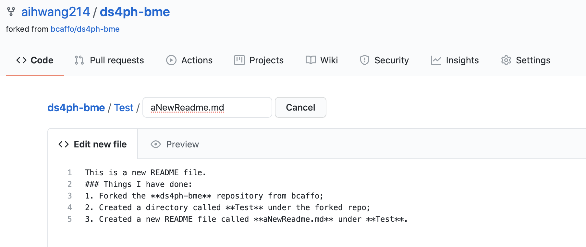
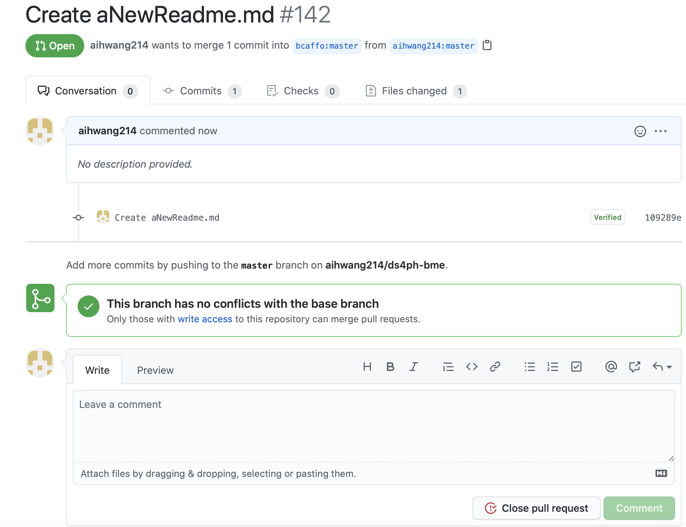
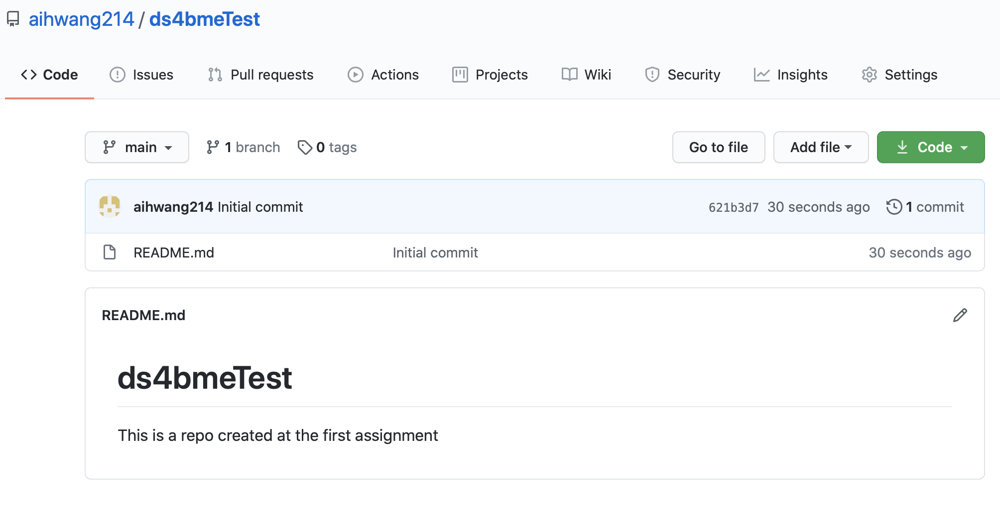
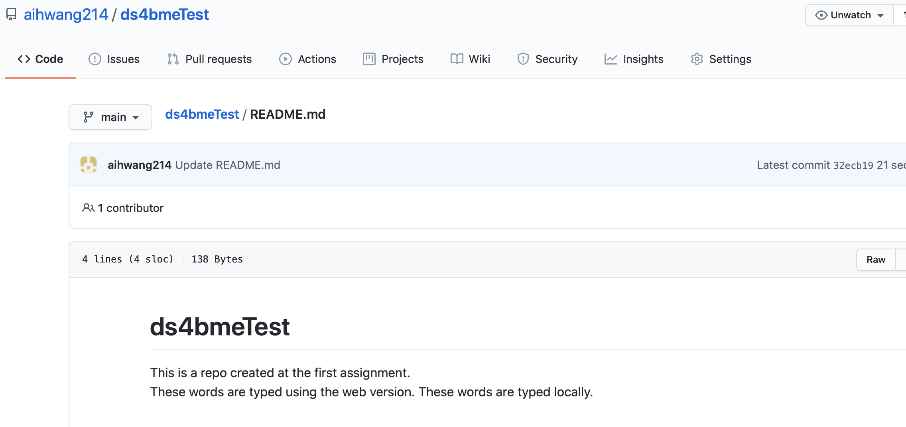
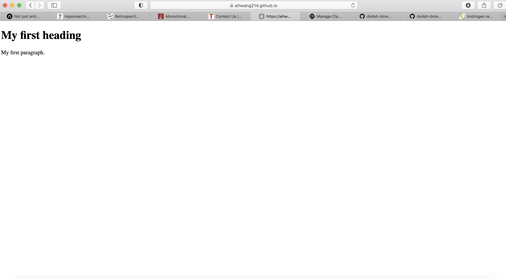
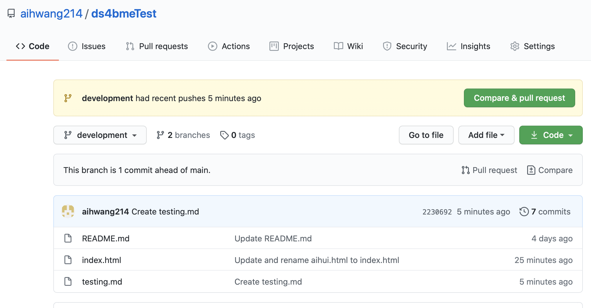

This is a new README file.
### Things I have done for Assignment1:
1. Forked the **ds4ph-bme** repository from bcaffo;created a directory called **Test** under the forked repo; created a new README file called **aNewReadme.md** under **Test**.  
2. Issued a pull request. 
3. Created a new repository called **ds4bmeTest**; added a new README file. 
4. Cloned the **ds4bmeTest**; made a change and pushed it. 
5. Created a web page called **index.html** and served it. 
6. Created a branch called **development** from **ds4bmeTest**; added **testing.md**. 
