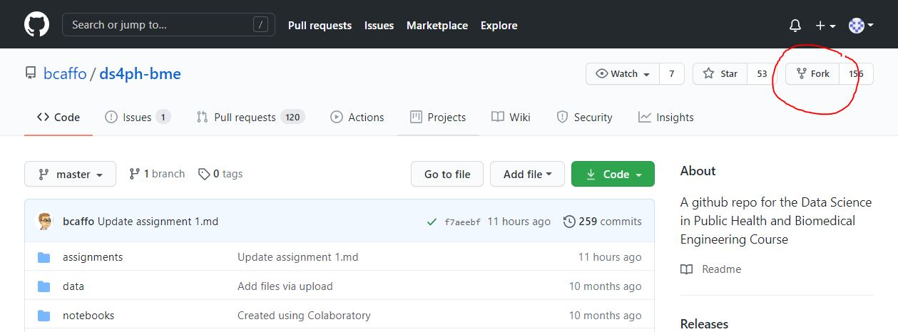
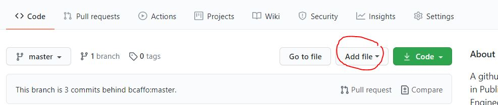
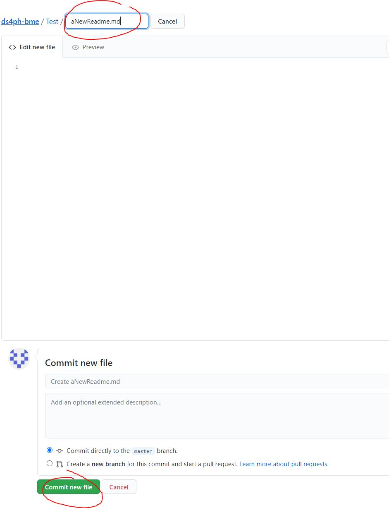
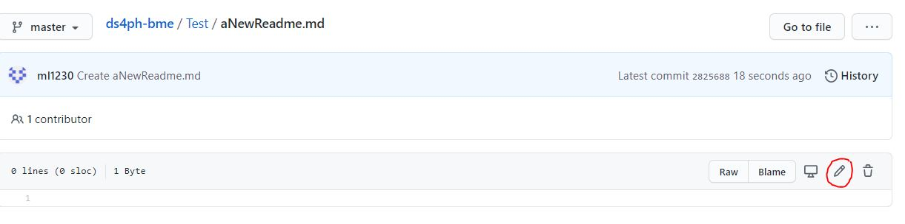

# Description
## step1
Open the gitbub in the internet, and go to the repository ds4ph-bme of bcaffo. Then click the 'Fork' button in the right corner

## step2
Once the repo is forked under my repository list, I add a directory by clicking the 'Add file' button. Folder name 'Test' will be created followed by'\' to make it a directory

## step3
A directory will be created

## step4
Then, I create a 'aNewReadme.md' markdown file, and click 'Commit new file' button in the bottom

## step5
In the markdown file, click the pencil icon in the right side of the bar

## step6
In order to upload screenshot in this .md file, I create a screenshots folder using the similar way, and I upload the screenshots in the screenshots folder. Then I can pull the screenshots in this .md file

