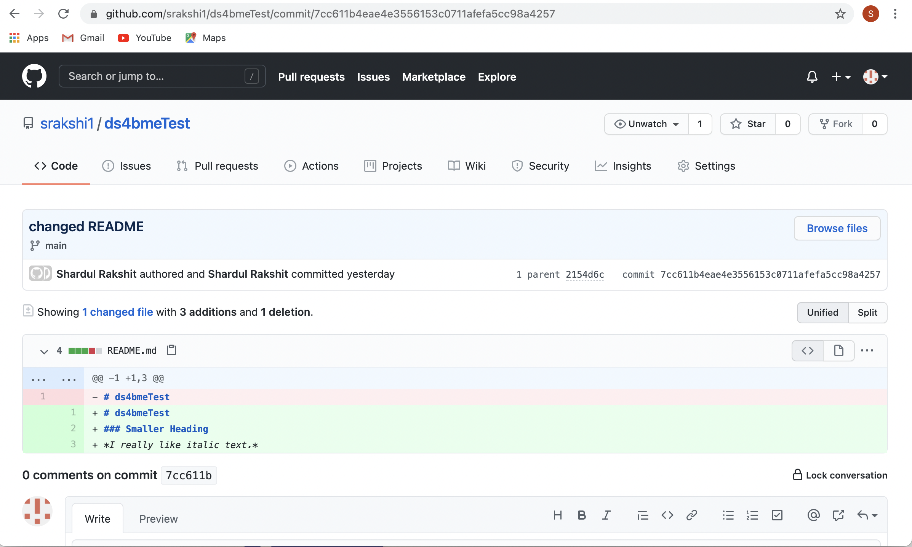
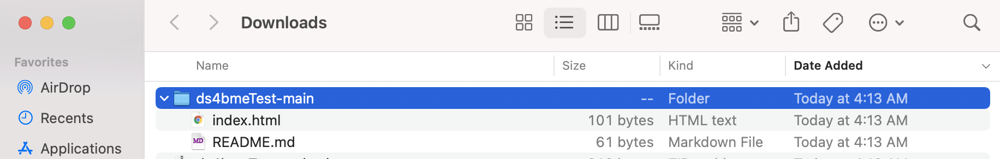

# Questions 3-6, Assignment 1
Here's a brief description of what I did for question 3-6. For questions 1 and 2 where I create a pull request to the course repository from this repository, see the github classroom repo.

*Questions 3 and 4*
This picture shows the commit I made to ds4bmeTest where I changed the original README file. It shows that I created the ds4bme repository, added an initial README file, and then changed it in the commit history.

This picture shows that I ds4bmeTest repository locally in my downloads:

*Question 5*
Here's a picture of the webpage I served using github pages in my ds4bmeTest repo:

The webpage can be accessed at [this link](https://srakshi1.github.io/ds4bmeTest/).

*Question 6*
This picture shows the development branch I created in my ds4bmeTest repo:

This picture shows the actual testing.md file in the repo:

