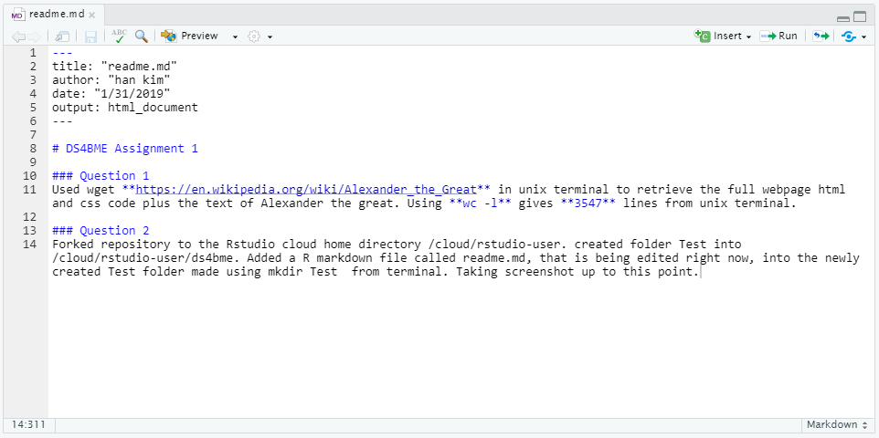
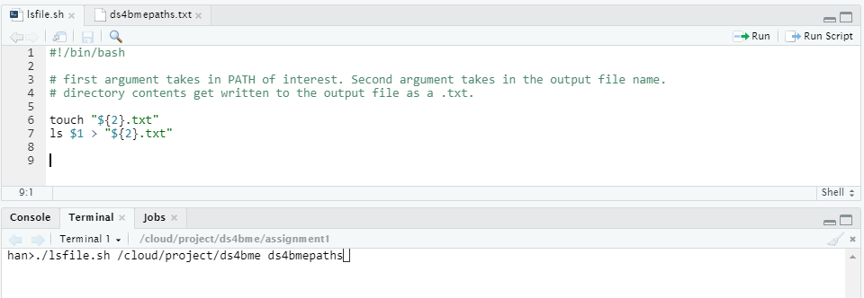

### Question 1
Used wget **https://en.wikipedia.org/wiki/Alexander_the_Great** in unix terminal to retrieve the full webpage html and css code plus the text of Alexander the great. Using **wc -l** gives **3547** lines from unix terminal.

### Question 2
Forked repository to the Rstudio cloud home directory /cloud/rstudio-user. created folder Test into /cloud/rstudio-user/ds4bme. Added a R markdown file called readme.md, that is being edited right now, into the newly created Test folder made using mkdir Test  from terminal. Taking screenshot up to this point. Found in figure 1. 

### Question 3
Issued a pull request to the course repository. Created a screenshot -> question3.PNG attached below. Found in figure 2. 

### Question 4
Created new github repo called ds4bmeTest with added readme.md file. Found in figure 3. 

### Question 5

### Question 6
Bash script file lsfile.sh. Takes in argument ./lsfile.sh PATH(/cloud/project/ds4bme) outfile(ds4bmepaths). chmod 775 was used to make lsfile.sh executable without needing to use bash command first. Outfile.txt contains the path directory created from the ls command. Screenshots in figure 4,5. 

### Question 7

