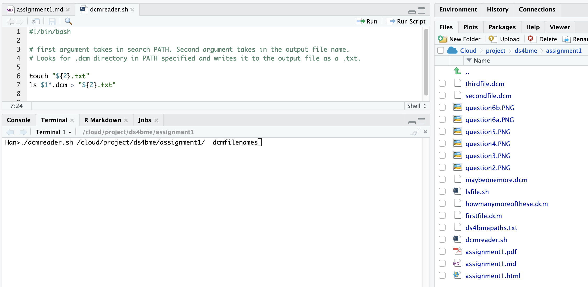
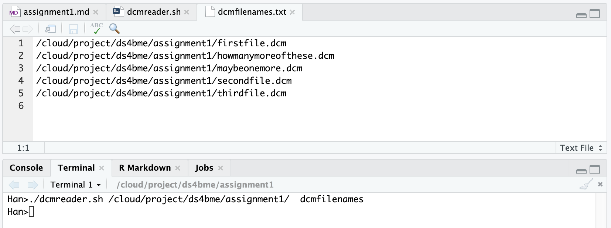

All work was done through rstudio.cloud. 

### Question 1
Used **wget https://en.wikipedia.org/wiki/Alexander_the_Great** in unix terminal to retrieve the full webpage html and css code plus the text of Alexander the great. Using **wc -l** gives **3547** lines from unix terminal.

### Question 2
Forked repository to the Rstudio cloud home directory /cloud/rstudio-user. created folder Test into /cloud/rstudio-user/ds4bme. Added a R markdown file called readme.md, that is being edited right now, into the newly created Test folder made using mkdir Test  from terminal. Taking screenshot up to this point. Found in **figure 1**. 

### Question 3
Issued a pull request to the course repository. Created a screenshot -> question3.PNG attached below. Found in **figure 2**. 

### Question 4
Created new github repo called ds4bmeTest with added readme.md file. Found in **figure 3**. 

### Question 5
Created and deployed a tempate webpage on github.io/hkim171 then edited some of the html content and included my own image. 

### Question 6
Bash script file lsfile.sh. Takes in argument ./lsfile.sh PATH(/cloud/project/ds4bme) outfile(ds4bmepaths). chmod 775 was used to make lsfile.sh executable without needing to use bash command first. Outfile.txt contains the path directory created from the ls command. Screenshots in **figure 4,5**. 

### Question 7
Modified above bash script in question 6 to recognize only .dcm files by using *.dcm. the dcmreader.sh file takes in two arguments. 1. directory where files should be searched (will not search additional folders if other folders exist) and 2. the output file name which will be saved as a .txt. 

