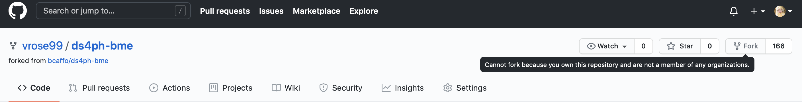
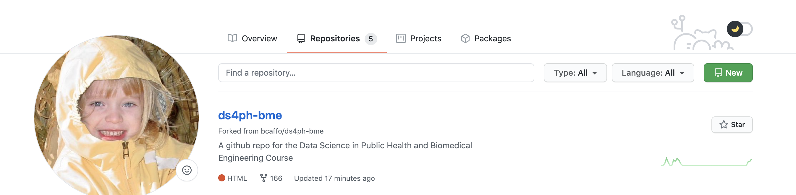
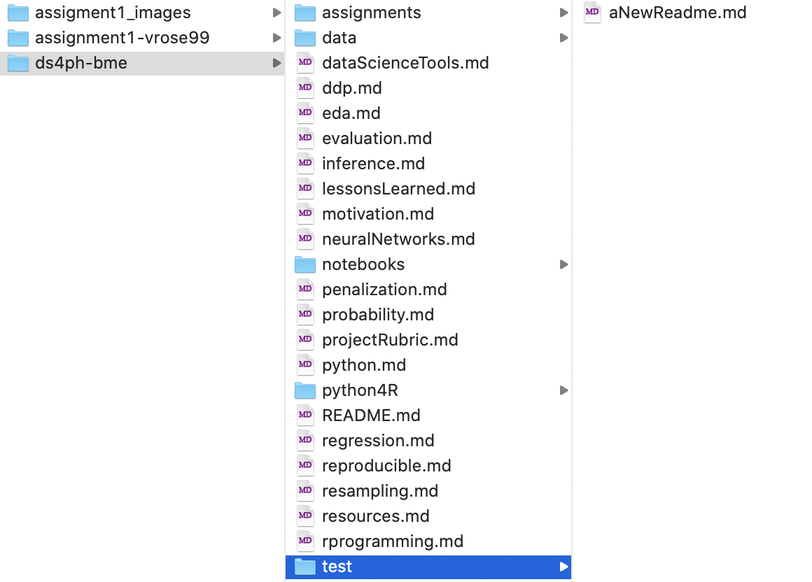

# Assignment 1
## Vrose9  (Tori Rose)
## gitid: vrose99

## 1. Forking 
* Fork the Repository 
fork from the source repository

view it on my repsitory list

clone to desktop & add new directory + file
* Create a directory called Test & add a markdown file called ''aNewReadme.md''

## 2. Pull Request
will be pictured in the assignment file!